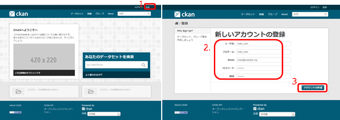
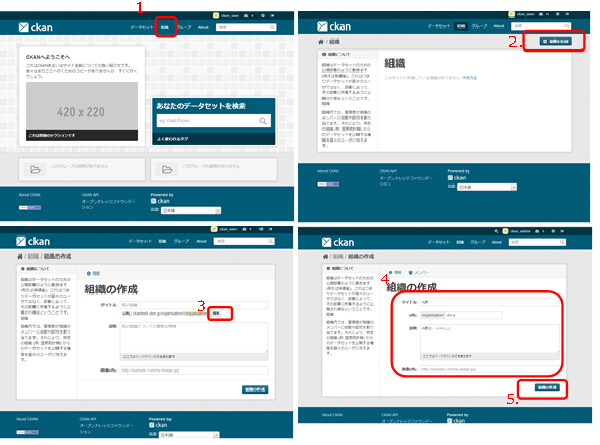
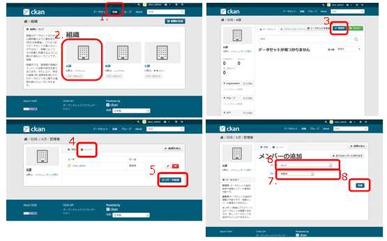
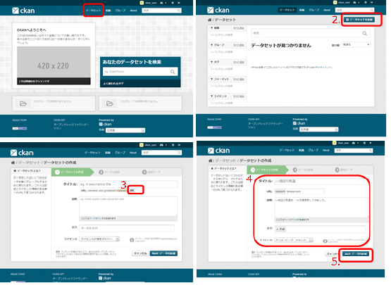
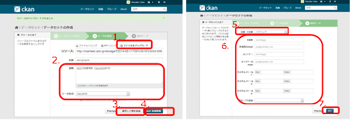
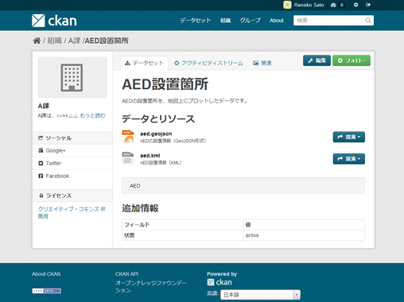
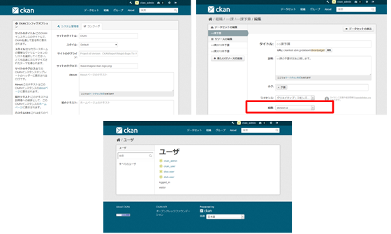

##  CKAN

### ツール概要
データカタログシステムの1つ。   
Web ベースのデータ管理・配信システム。

CKAN は、[data.gov](http://data.gov) (米国)、[data.gov.uk](http://data.gov.uk) (英国)、[publicdata.eu](http://publicdata.eu) (EU)、[data.gov.au](http://data.gov.au) (オーストラリア)、[DATA.GO.JP](http://data.go.jp) (政府データカタログサイト)、[datameti.go.jp](http://datameti.go.jp) (Open DATA METI)等、オープンデータを配信する多くの政府系組織で利用されている。

### ツール開発者
[The Open Knowledge Foundation](http://www.okfj.org)

### ライセンス・価格
* The GNU Affero General Public License (AGPL) v3.0 
* 無料

### ツール入手方法
<http://ckan.org/developers/docs-and-download/>からダウンロードできる。

### インストール方法
下記Webページに、公式のインストール・設定方法がまとめられている。   
<http://docs.ckan.org/en/latest/>   

また、下記ページは、環境ごとのインストール方法を紹介している。   
<https://github.com/okfn/ckan/wiki/How-to-Install-CKAN>

### バージョン
2.1

### 使用方法
#### 用語解説
CKANで利用されている用語の解説を以下に記す。

* ユーザ
    * CKANにデータを登録する主体。
* データセット   
    * 複数のデータをまとめたもの。
    * 例えば、「○○年統計データ」「××地区温度データ」等。
* 組織
    * データの公開・管理（アクセス制御）を行う主体。
    * 例えば、「○○省」「○○課」「○○局」等。
    * 組織単位でデータセットを管理できる。
    * 組織に追加したユーザに、データセットの追加・編集権限や閲覧権限を与えられる。
* グループ   
    * データセットをコミュニティやトピック単位でまとめたもの。
* タグ   
    * データの特徴を説明したもの。
    * 例えば、「財政」「測量」「交通」等。
    * データを検索するためのキーになる。

#### CKANの運用前に検討・準備すべき事項
CKANを利用してデータカタログを運用する前に、以下に示す事項を検討・準備しておくことが望ましい。

##### 公開するオープンデータの洗い出し
公開対象のオープンデータをリストアップする。

##### オープンデータを管理するポリシの策定
以下に示すポリシを事前に策定することが望ましい。

1. データセット・組織の決め方
    * 公開・非公開の制御はデータセットごとになされる。非公開のデータセットは、データセットが属する組織に所属するユーザのみが閲覧できる。
    * 上記を参考に組織とデータセットをリストアップし、公開対象のオープンデータを、データセットごとにまとめる。
2. グループやタグの決定
    * グループやタグは、利便性を向上させるための項目である。グループやタグとして何を設定するか、また、各オープンデータをどのグループやタグに所属させるかを決定する。
3. データ提供の利用ルールの選定
    * それぞれのオープンデータに対して適用すべき利用ルールを選定する。
4. データの登録・管理規則の策定
    * CKANにアクセスしてデータを登録する担当者とその手順を明確にし、規則として明文化する。アカウントの発行申請手順や、データの登録承認手続き等がこれに当たる。
    * また、組織ごとに、管理者ユーザを定める。

#####	要求仕様の策定
CKANシステムのインストールには、サーバシステムの知識が必要である。また、利用形態によっては、コンソール操作や、システムのコード変更を要する設定もある。   
これらの作業を外部委託するならば、少なくとも以下の項目を記した要求仕様を準備する。

* 対象とするオープンデータのリスト。
* 登録するデータセット・組織とそれらに所属させるオープンデータ・ユーザ
* グループ・タグの設定。
* ホームページからユーザ登録できないようにするためには、その指示。

要求仕様に、運用マニュアルの作成を含めることが望ましい。

#### データの整備計画
リストアップしたデータを、機械判読性の高いデータに変換するための計画を立て、それに基づき実施する。   
データは、たとえ機械判読性が低くてもオープンな利用ルールでなくても、公開されることが望ましい。機械判読性の高いデータやオープンな利用ルールが整備でき次第、追加・更新すればよい。   
計画は年度等、ある程度の期間ごとに、実施状況と比較して見直すことが望ましい。

### CKANを用いたオープンデータ登録例
X市は、CKANを利用し、下表に示すオープンデータを管理することを決定した。

| タイトル | ファイル形式 | 利用ルール | 管理部署 |
|:------|:--------|:-------|:-------|
|AED設置場所|GeoJSON / KML|CC-BY|A課|
|平成25年度人口統計|Excel(.xslx) / CSV|CC-BY|B課|
|平成26年度予算|CSV|CC-BY|C課|

また、このオープンデータの管理は各課が行うこととし、下表に示す人員が関与することになった。

|人員|所属課|アカウント名|
|:---|:----|:----|
|山田 太郎|（システム管理者）|ckan_admin|
|佐藤 花子|A課|div_a|
|鈴木 次郎|B課|div_b|
|山本 三郎|C課|div_c|

CKANの初期状態から上記のデータを登録する手順を、以下に示す。

#### アカウント登録
各担当者は、CKANにデータを登録するユーザ（アカウント）を登録する。その登録方法は、以下のとおりである。

1. 初期画面の右上にある「登録」リンクをクリックする（左図）と、ユーザ名やメールアドレスを入力する画面が表示される（右図）。   
2. ユーザ名・メールアドレス・パスワード等、必要事項を入力する。   
3. 「アカウントの作成」ボタンを押すと、登録が完了する。このとき、ログインされた状態になっている。

アカウントを登録したら、一旦ログアウトし、登録したアカウント情報をシステム管理者に通知する。

   
図 アカウントの登録

#### 組織の登録（システム管理者）
システム管理者は、データのアクセス制御をしつつ各課がオープンデータを登録できるようにするために、各課を組織として登録する。以下にその手順を示す。

1. 初期画面（ログイン後の画面／左上）の上にある「組織」をクリックする。
2. 「組織を追加」ボタンを押す（右上）。
3. タイトル欄の下にある「編集」ボタンを押す（左下）。
    * タイトル・URL・説明・画像URLを入力する。
    * URLのみ必須である。
    * タイトルが英数字のみの場合は、3.の処理は不要である。
4. URL欄には、タイトルとほぼ同じ意味の英数字を入力する（右下）。
5. 「組織の作成」ボタンを押す。これで組織の登録が完了である。

なお、組織を作成したユーザが、組織の管理者となる。今回の事例では、システム管理者が組織の管理者となる。

   
図 組織の作成

#### 組織へのメンバ追加（システム管理者）
システム管理者は、続いて作成した組織にメンバを追加する。A課にユーザ「div_a」を追加する手順を以下に示す。

1. 初期画面（ログイン後の画面／左上）の上にある「組織」をクリックする（左上）。
2. 組織「A課」を選択する。
3. 組織ページにある「管理者」ボタンを押す（右上）。
4. 「メンバ」タブを押す（左下）。
5. 「メンバの追加」ボタンを押す。
6. ユーザの入力欄をクリックしてユーザ名「div_a」を入力する（右下）。
    * 途中まで入力すると、候補が表示されるので、そこから選択できる。
7. このユーザに与えるロールを選択する。
    * ロールは「管理者」「編集者」「メンバ」の3種類であり、画面左側に説明がある。
    * 今回の事例では、「編集者」を選択する。
8. 「追加」ボタンを押す。

この作業が完了した時点で、システム管理者は各担当者に連絡する。

   
図 組織へのメンバ追加

#### データセットの作成
システム管理者から通知を受けた担当者は、データセットを作成し、登録する。   
「A課」の「AED設置箇所」を例に、その手順を示す。

1. 初期画面（ログイン後の画面／左上）の上にある「データセット」をクリックする。
2. 「データセットを追加」ボタンを押す（右上）。
3. タイトル「AED設置箇所」のほか、データの説明やタグを入力する（右下）。   
    * URLのみ必須である。
    * タイトルが英数字のみでない場合は、タイトル欄の下にある「編集」ボタンを押し、現れるURL欄にタイトルとほぼ同じ意味の英数字を入力する。
4. 「ライセンス」欄は、「AED設置箇所」の利用ルールが「CC-BY」であるため、「クリエイティブ・コモンズ 表示」を選択する。
5. このデータセットが属する組織を選択する。このユーザはA課のデータのみ編集できるため、選択肢には「A課」を示す「div_a」のみ表示されている。
6. 「Next: データの追加」ボタンを押す。このあと、データの登録画面に遷移する。

   
図 データセットの作成

#### データの登録
データセットの登録の終了後、そのデータセットに属するデータを登録する。   
今回は、「AED設置場所」のデータとして「aed.geojson」と「aed.kml」をアップロードする。前節に続き、その手順を示す。

1. 登録するデータを登録する。（左図）。   
    * データは「ファイルへのリンク」「APIへのリンク」「ファイルのアップロード」から選択する。今回は「ファイルのアップロード」を選択し、アップロードするファイルである「aed.geojson」を選択する。   
    * 「ファイルのアップロード」をするには、サーバにdatastoreの設定が必要である。
2. 「説明」欄を入力し、「データ形式」欄には「GeoJSON」と入力する。
3. 「保存して追加」ボタンを押し、項番1～2を繰り返して「aed.kml」をアップロードする。「データ形式」欄には「KML」と入力する。
4. 「Next: 追加情報」ボタンを押す。   
5. 「公開・非公開」欄は「パブリック」を選択する（右図）。
    * 「プライベート」を選択すると、組織に属するユーザのみがそのデータセットを閲覧できる。この機能は、公開前の確認用として利用できる。
6. データの作成者やそのemail、メンテナ、所属するグループ等を、必要な追加情報を入力する。これらはすべて任意である。
7. 「完了」ボタンを押す。これでデータの登録が完了である。

   
図 データの登録
 
データの登録が完了すると、下図のような画面が表示される。

   
図 データ登録後の画面
 
B課、C課が管理する情報も、本節と前節に記載した手順に従って登録する。   
登録完了後、データセットの一覧は下図のようになる。

   
図 データセット登録完了後の一覧画面
 
### CKANの管理ページ
CKANの管理者は、データカタログシステムの管理ページにアクセスできる。   
管理者は、データカタログ内の全ユーザ・データセット・データを閲覧・編集・削除できる。

ホームページからは、以下のような機能を利用できる。

* ホームページの見栄え（Look & Feel）の変更（左上）      
* データセットが所属する組織の変更（右上）   
* データセットの削除   
* ユーザ管理（下）

   
図 CKANの管理画面

 