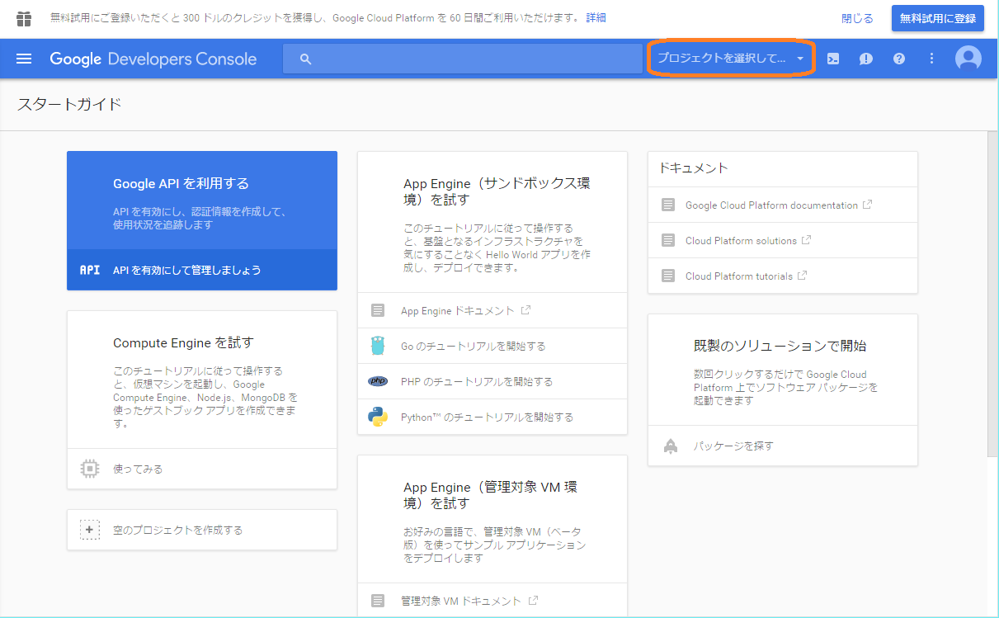
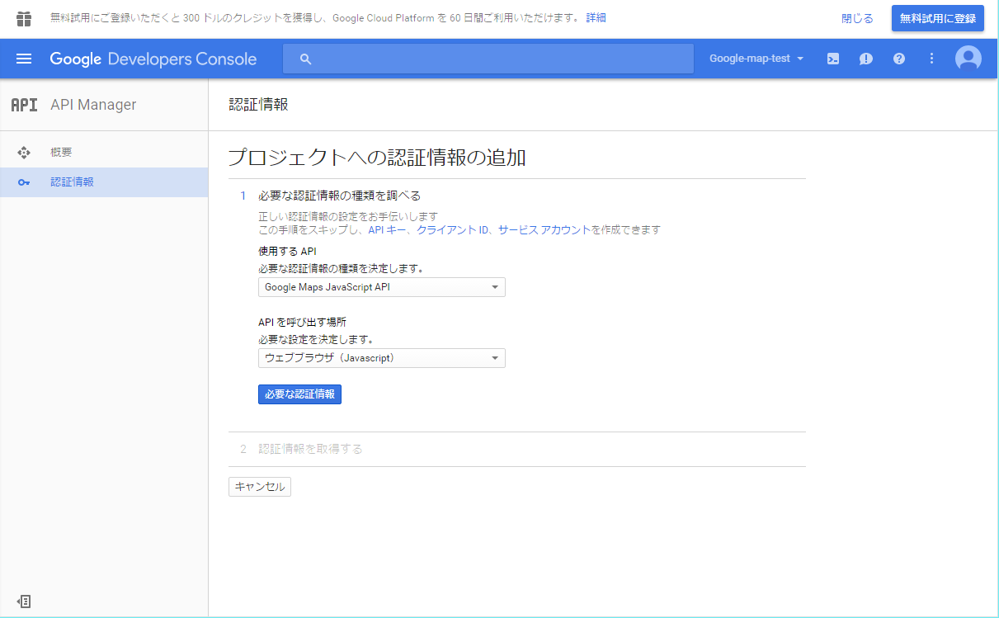

##  Google Maps

### ツール概要
Google Mapsは、We地理空間情報の可視化・公開をするためのツールである。

### ツール開発者
Google Inc.

### ライセンス・価格
[価格とプラン](https://developers.google.com/maps/pricing-and-plans/?hl=ja#details) がGoogleから公開されている。

### ツール入手方法
[Google APIs Console](https://code.google.com/apis/console) より入手する。

下記ページに、Google Maps APIのドキュメントが掲載されている。  
<https://developers.google.com/maps/documentation/javascript/reference>

また、下記は非公式の日本語版ドキュメントである。  
<https://sites.google.com/site/gmapsapi3/Home/v3_reference>.
　
### インストール方法
インストールは必要ない。

### 使用方法
#### 1. APIキーの発行（初回のみ必要）
手順1. [Google APIs Console](https://code.google.com/apis/console) にアクセスする。  
  
Google アカウントを持っていない方は、「アカウントを発行」リンクよりアカウントを発行できる。

手順2. 「プロジェクトを選択してください」ボタンから「新しいプロジェクトを作成」を選択する。  
  

手順3. プロジェクト名を入力し、メール受信の確認と利用規約の同意を行って、「作成」ボタンを押す。  
  

手順4. プロジェクトを作成すると、ダッシュボード画面に遷移する。「APIを有効にして管理しましょう」リンクをたどる。  
  

手順5. 利用するAPIを選択する。今回は「Google Maps Javascript API」を選択する。  
  

手順6. 「APIを有効にする」ボタンを押す。  
  

手順7. 「認証情報に進む」ボタンを押す。  
  

手順8. 「APIを呼び出す場所」の設定として「ウェブブラウザ（Javascript）」を選択し、「必要な認証情報」ボタンを押す。  
  

手順9. 名前を入力し、「APIキーを発行する」ボタンを押す。  
  

手順10. 表示されたAPIキーを保存する。  
  

#### 2. サンプル地図の作成
WebページにGoogle Mapsを表示させるために必要なコードは、以下の4つである。

##### 1. Google Maps API Keyを含む、Javascriptコードの読み込み宣言
 `` 
というコードを、`<head>`タグの中に記述します。

##### 2. 地図を表示するためのコード
以下のようなコードを、`<head>`タグの中に記述する。

    
 
##### 3. 地図を表示する場所を示すdivタグ
`<body>`タグの中に`
`タグを置き、その名称を上記のコード内 `getElementById` の引数値とする。

##### 4. Javascriptを自動起動するためのコード
`<body>`タグの属性として `onload="(上記Javascriptの関数名)"` を追加する。

[上記4つを含むサンプルコード](samples/gmap/sample-map.html) の実行結果は以下の通りである。ただし、サンプルコード内の `__APIKEY__` 部分を、取得した API KEYに置き換えること。
  
