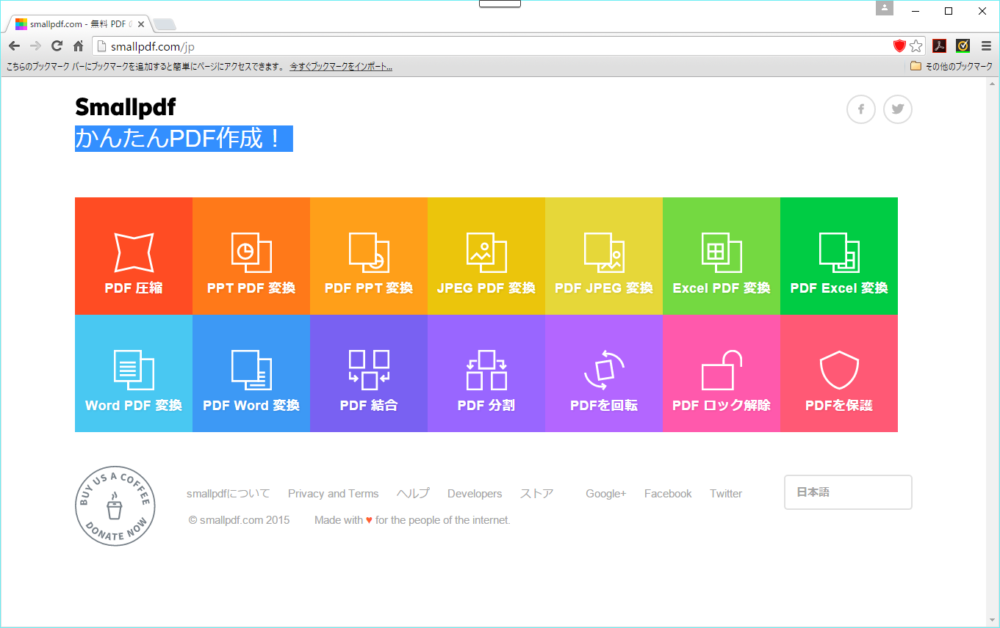
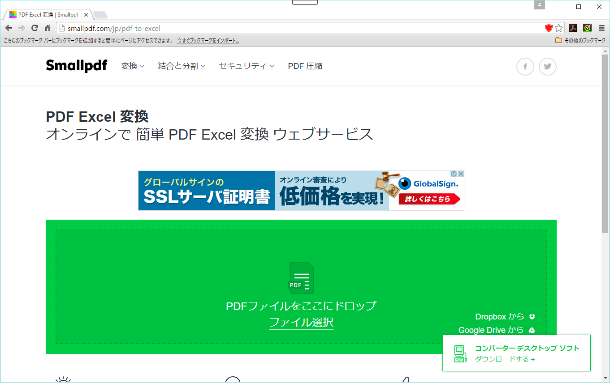
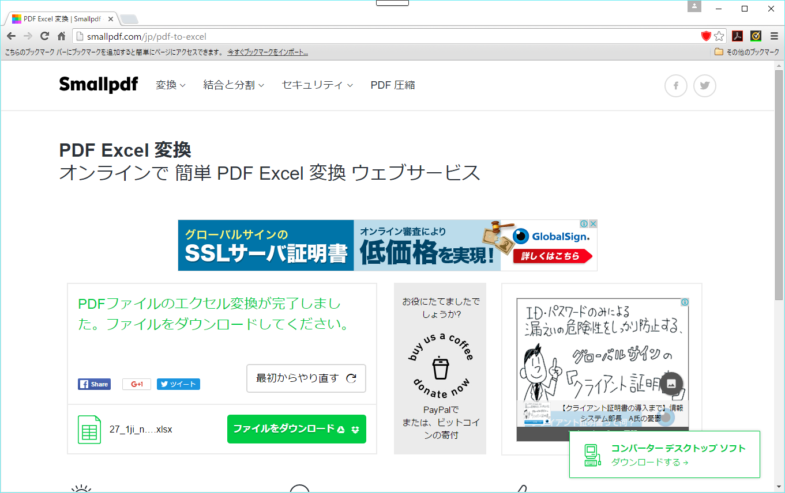

## SmallPdf

### ツール概要
PDFと各種ファイル形式を、Web上で変換するツール。

### ツール開発者
smallpdf.com

### ライセンス・価格
無償で利用できる。

ドネーションを求めている。

### ツール入手方法
[SmallpdfのWebページ]（http://www.smallpdf.com/jp/）に接続して利用できる。

### インストール方法
Web上で動作するため、インストールは必要ない。

### バージョン
（非公開）

### 使用方法
PDFファイルをExcelに変換する手順は、以下の通りである。

||操作|画像|
|:-|:-|:-:|
|1|[SmallpdfのWebページ]（http://www.smallpdf.com/jp/） にある、「PDF Excel 変換」をクリックする。||
|2| 「ここにドロップ」と書かれた箇所にPDFファイルをドロップする||
|3|変換が完了すると、「ファイルをダウンロードしてください」という画面に遷移する。「ファイルをダウンロード」リンクをクリックすると、変換されたExcelファイルを入手できる。||

